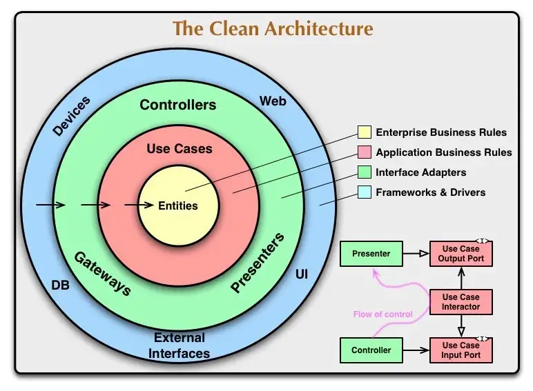
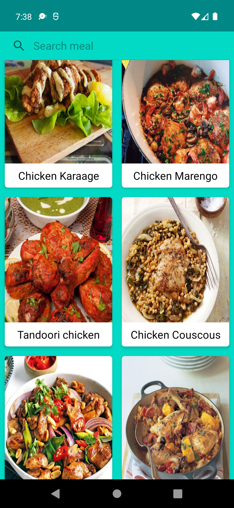
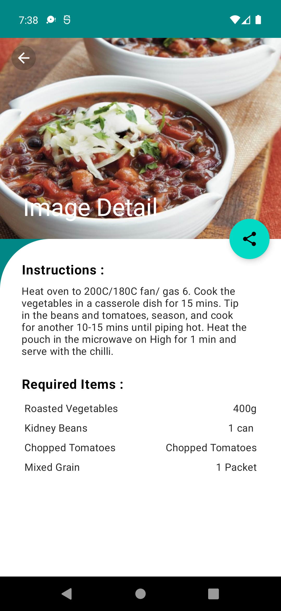

## Food Search App
- Android  application written with kotlin programming language.
- Use Clean Architecture.
- Create the object of fragments with factory method and inject to NavHostFragment using Hilt.
 

Minimum API level supported is: 23

 
- Build System: [Gradle](https://gradle.org)

## Table of Contents
-  [Prerequisite](#prerequisite)
-  [Architecture](#architecture)
-  [TechStack](#techstack)
-  [Screenshots](#screenshots)
 

## Prerequisite
- To run these application you need 
* Android Studio.
 

## Architecture
- These application is build using MVVM architecture to allow separation of concerns.
- Clean Architecture 

 

## TechStack
 * [Kotlin](https://developer.android.com/kotlin) - Cross-platform, statically type, general purpose programming language with type inference.
 * [Hilt](https://developer.android.com/training/dependency-injection/hilt-android) - Dependency injection library for android.
 * [NavigationComponets](https://developer.android.com/guide/navigation/navigation-getting-started) 
 * [Retrofit](https://square.github.io/retrofit/) - A Type-safe HTTP client for android and java used to consume REST APIs.
 * [Gson](https://github.com/google/gson) - Used to convert Json to java and kotlin objects.
 * [Glide](https://github.com/bumptech/glide) - Image loader library for android.
 * [Diff Utill Adapter] - This class finds the difference between two lists and provides the updated list as an output.
 * [ViewModel](https://developer.android.com/topic/libraries/architecture/viewmodel) - Used to store and manage UI related data in a lifecycle concious way.
 * [Data Binding](https://developer.android.com/topic/libraries/data-binding) - Allows you to bind UI components in your layouts to data sources in your app 
 * [Timber](https://github.com/JakeWharton/timber) - Android Logger with a small and extensible API.
 * [Glide](https://github.com/bumptech/glide) - Image loading framework for android that wraps media decoding, memory and disk caching.
 * [Flow API](https://kotlinlang.org/docs/flow.html#sequences) - In coroutines, a flow is a type that can emit multiple values sequentially, as opposed to suspend functions that return only a single value.
 * [Binding Adapters] - Use to load image using  Glide library in different class.
 

